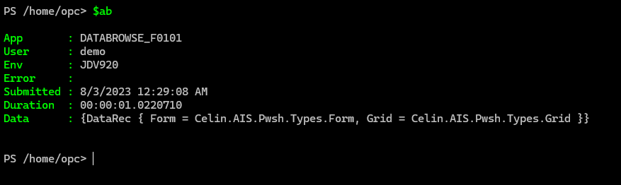
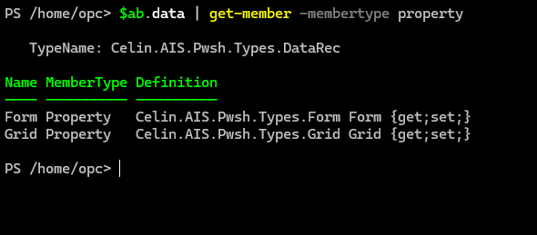
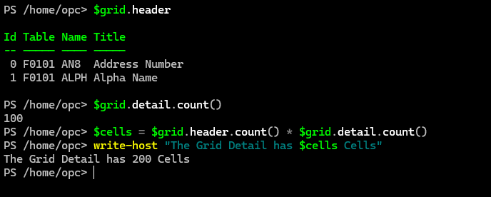

## Quick View

This is the short introduction to the results of an Celin.AIS.Query or Celin.AIS.Script command.

Let's assume we have the `$ab` variable of the following Address Book query (from Get Started):

```powershell
$ab = Submit-Celin.AIS.Query "f0101 (an8,alph,at1) all(at1=C)"
```

### The State

The results are layered with the generic information in the top, or outer layer and becoming more specific on further drill down.

The top layer, or the state gives information such as the source and time of execution, as well as any error text returned from the execution.

> Note: There are two types of failures.  A terminal failure such as authorisation expired or invalid requests result in termination of the command with exception.  A successful request can however return error which means that no data is returned.

To view the state, simply type the variable name.



Individual state members are accessed with the dot operator.  For example to test if the command was successful, we check the `Error` member.

```powershell
$success = -not $ab.error
if ($success) { write-host "Success" } else { write-host "Failed" }
```

> Note: PowerShell is not case sensitive, so `Error` and `error` are equivalent.

## The Data

The `Data` member contains the actual result of the request and can be accessed with the dot operator.  A more informative display can be achieved by piping it to the `Get-Member` command.



- `Form` : A list of fields on the requested form.  This will be empty for queries and covered in separate page.
- `Grid` : The grid on the requested form, table or business view.

## The Grid

A convenient way of handling nested variables is to assign the member we are interested into a new variable, `$grid` in this case.  We then pipe it to the `Get-Member` command to display its members.

```powershell
$grid = $ab.data.grid
$grid | get-member -membertype property
```

- `Detail` : The grid data as two dimensional list of rows and columns.
- `Header` : The grid header as a list of columns with `Id`, `Table`, `Name` and `Title` members.
- `MoreRecords` : A flag to indicate if maximum rows limit was reached.

To get a quick idea about the grid, list the `Header` columns and count how many cells are in the `Detail`.



Display the first row of the `Detail`.


## As Table

The `Detail` member has a `ToTable(string[] headers)` method that can be used to transform it to a PowerShell table.  The `headers` parameter is a an string array that much match the `Detail` column count.

The `Header` member has `Names` and `Titles` members that can be passed directly as `headers` parameter.

```powershell
# Display the grid in a paged tabular form with titles
$grid.detail.totable($grid.header.titles) | out-host -paging
# With alias
$grid.detail.totable($grid.header.names) | out-host -paging
```
