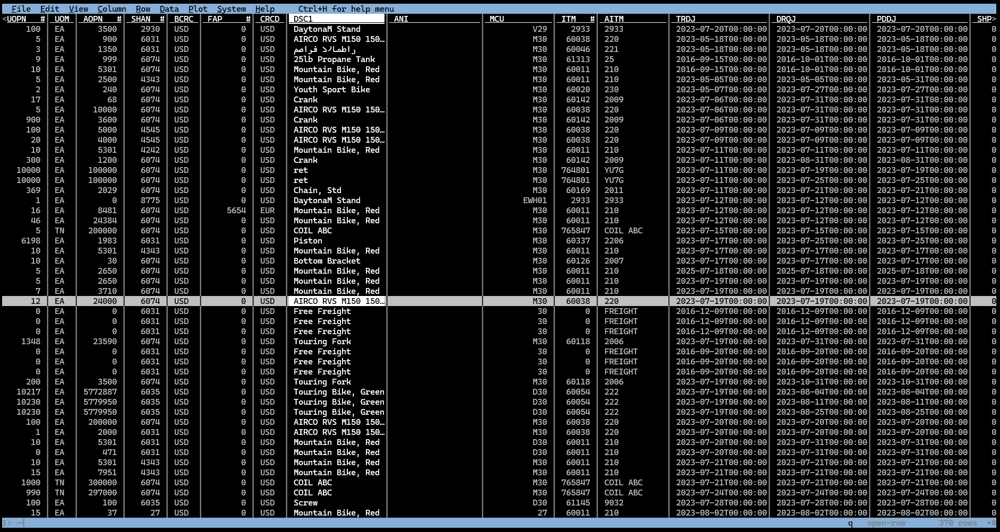

## Explore with Visidata

There are number of options when exploring data containing tens of columns and hundreds or thousands of rows.  The best known and most common tool, almost the default go-to is Excel.  But for a quick exploration without leaving the PowerShell terminal, the blazing fast [Visidata](https://www.visidata.org) is ideal.

### Open Purchase Orders

Fetch the grid data from Work With Purchase Orders to Receive (P4312).

```powershell
$pos = submit-celin.ais.query "w4312f zjde0001 -max no"
```

For `Visidata` to accept the result, the data must be converted to one of the forms it recognises, in this case we use JSON.

```powershell
$pos.data.grid.detail.totable($pos.data.grid.header.names) | convertto-json | vd -f json
```

The above command uses the `ToTable(string[] columns)` method of the `Detail` to convert it to table with the `Name` property (alias).  This is then piped to the `ConvertTo-Json` command and then finally piped to `Visidata` with the format options (`-f`) set to `JSON`.


